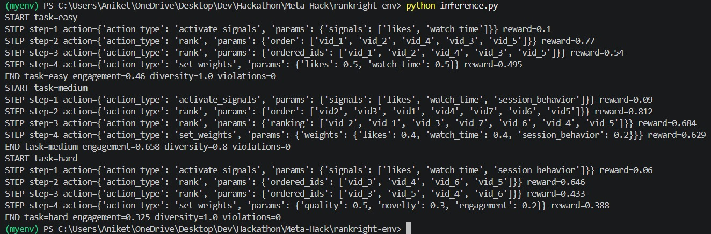
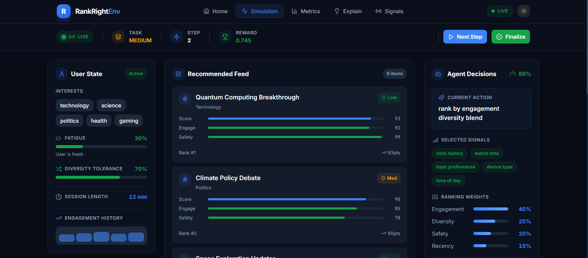

# RankRightEnv: Policy-Aware Recommendation Governance Environment

> **A simulation environment where AI agents must optimize recommendations under policy, safety, and diversity constraints — not just engagement.**

---

## 🚨 Problem

Modern platforms like Instagram, TikTok, and YouTube rely almost entirely on **engagement-driven recommendation systems**.

While effective for retention, this leads to:

- **Echo chambers** and filter bubbles
- **Amplification** of sensational or harmful content
- **Overuse** of invasive or sensitive user signals
- **Lack of transparency** in decision-making
- **No explicit enforcement** of safety or platform policies

> The system optimizes for *"what keeps users hooked"*, not *"what should be responsibly recommended."*

---

## 🛡️ Our Approach

RankRightEnv introduces a **policy-aware recommendation framework** where optimization happens under real-world constraints.

Instead of blindly maximizing engagement, agents must:

- Respect **platform policies and signal restrictions**
- Maintain **content diversity and fairness**
- Avoid **harmful or high-risk recommendations**
- Balance **trade-offs between engagement, safety, and compliance**

---

## 🧠 Core Insight

> Recommendation is **not just ranking** — it is a multi-decision pipeline.

1. **Which signals to use** (with privacy constraints)
2. **How to weight them** (under policy rules)
3. **What content to prioritize** (balancing quality, novelty, risk)
4. **How to satisfy platform governance**

This makes it a **governance + optimization problem**, not a pure ranking problem.

---

## 🏗️ System Architecture

```
reset() → observe → act → step() → reward → repeat → finalize()
```

### Core Components

| Component | Role |
|---|---|
| **Environment Engine** | State management across steps |
| **Policy Engine** | Constraint enforcement & violation detection |
| **Ranking Engine** | Content scoring and ordering |
| **User Simulator** | Realistic behavior modeling |
| **Reward Engine** | Multi-objective reward computation |
| **Grader** | Final deterministic score (0.01 → 0.99) |

---

## 🧩 Environment Overview

| Property | Value |
|---|---|
| Action Space | Multi-action (signals + ranking + weights) |
| Observation | User + signals + candidates + policy |
| Reward Range | 0.01 → 0.99 |
| Difficulties | Easy · Medium · Hard |
| Episode Length | ≤ 4 steps |
| Objective | Multi-objective optimization |

---

## 📊 Observation Space

```python
class Observation:
    task_id: str
    step_count: int
    user_summary: dict          # Interests, fatigue, topic history
    available_signals: list     # All signals with permission levels
    active_signals: list        # Currently enabled signals
    candidates: list            # Content with quality, novelty, risk scores
    policy_constraints: dict    # Current platform rules
```

---

## 🎮 Action Space

```python
class Action:
    action_type: str   # One of the supported actions below
    params: dict       # Action-specific parameters
```

| Action | Description |
|---|---|
| `activate_signals` | Enable allowed signals |
| `deactivate_signals` | Disable signals |
| `set_weights` | Adjust ranking weights |
| `rank` | Rank content candidates |
| `finalize` | End episode and submit |

---

## ⚖️ Signal Governance System

Signals are categorized by permission level:

| Type | Meaning |
|---|---|
| `allowed` | Free to use |
| `optional` | Requires user consent |
| `restricted` | Risky — penalized if misused |
| `disallowed` | Forbidden — immediate penalty |

> This introduces **privacy-aware decision making** as a first-class concern.

---

## 📦 Candidate Content Model

```json
{
  "id": "vid_1",
  "topics": ["tech"],
  "quality": 0.9,
  "novelty": 0.6,
  "risk": 0.2
}
```

---

## 🎯 Reward Function

```
Reward = Engagement + Diversity + Safety − Policy Penalties − Signal Costs
```

| Component | Meaning |
|---|---|
| **Engagement** | How well content matches user interests |
| **Diversity** | Topic variety across recommendations |
| **Safety** | Penalizes high-risk content |
| **Policy Penalties** | Violations of platform constraints |
| **Signal Costs** | Overuse of restricted/optional signals |

---

## 👤 User Simulator

Simulates realistic user dynamics:

- **Interest matching** — relevance of recommended topics
- **Fatigue accumulation** — diminishing returns from repetition
- **Risk sensitivity** — user aversion to unsafe content
- **Topic memory** — tracks recent recommendations to penalize repetition
- **Hidden ground truth** — ideal preferences that the agent must discover indirectly

---

## 🔍 Hidden Ground Truth

Each scenario contains a hidden optimal state the agent must learn to approximate:

```json
{
  "ideal_topics": ["tech", "science"],
  "optimal_signals": ["watch_history", "explicit_likes"],
  "expected_engagement": 0.7
}
```

> The agent must **discover optimal behavior indirectly** — not from direct supervision.

---

## 🧪 Difficulty Levels

### 🟢 Easy
- Clear user preferences
- Low-risk content pool
- Simple signal choices

### 🟡 Medium
- Noisy or ambiguous signals
- Optional consent decisions required
- Trade-offs start to matter

### 🔴 Hard
- High-risk content temptation with short-term engagement gain
- Strict policy constraints
- Signal governance is critical to score well

---

## 📈 Grader System

Each task has a deterministic grader:

```python
score = f(engagement, diversity, safety, policy_compliance)
```

- **Range**: (0.01, 0.99)
- **Deterministic** — same actions always yield same score
- **Penalizes**: policy violations, unsafe content, signal misuse
- **Rewards**: balanced decisions, correct signal selection, topic diversity

---

## 🔌 API Reference

**Base URL:** `https://aniket-2004-rankright-env.hf.space`

| Method | Endpoint | Description |
|---|---|---|
| `POST` | `/reset` | Start a new episode |
| `POST` | `/step` | Apply an action |
| `GET` | `/state` | Get full environment state |
| `GET` | `/health` | Health check |

---

## 🤖 LLM Agent Integration

The environment supports LLM-based agents via an OpenAI-compatible client:

```python
client.chat.completions.create(
    model="...",
    messages=[...],
    # Strict JSON output enforced
)
```

Key agent behaviors:
- Strict JSON action output
- Retry handling on invalid actions
- Action validation before submission
- Fallback strategies on constraint violations

---

## 🖥️ Demo & Deployment

**Live App:** [https://meta-hack-delta.vercel.app](https://meta-hack-delta.vercel.app)

**HF Environment:** [https://aniket-2004-rankright-env.hf.space](https://aniket-2004-rankright-env.hf.space)

### Testing with LLM on HF Deployment



### App Demo



---

## 🐳 Deployment

- Dockerized environment
- Hosted on Hugging Face Spaces
- Fully reproducible builds

---

## 🧠 Why This is Novel

### 1. Signal Governance, Not Just Ranking
Most systems rank content. RankRightEnv requires agents to first **decide what signals are ethical to use**, then rank under those constraints.

### 2. True Multi-Objective RL Environment
Simultaneously optimizes across **engagement, safety, diversity, and policy compliance** — with real trade-offs between them.

### 3. Realistic Platform Simulation
Captures real-world failure modes:
- Echo chambers from signal over-reliance
- Privacy misuse through restricted signal activation
- Sensational bias from short-term engagement chasing
---

## 🚀 Future Scope

- RL training loop integration
- Multi-agent simulation
- Explainability and decision audit layer
- Real-world dataset integration (MovieLens, MIND, etc.)

---

## 👨‍💻 Developers

| Name | Role |
|---|---|
| **Aniket Atole** | Backend Developer and Deployment |
| **Vaishnavi Balodhi** | Frontend Developer, Deployment and System Design  |

*Built for the Meta × PyTorch × Hugging Face Hackathon*

---

## 🏁 Final Thought

This is not just a recommender system.

> **It is a simulation of responsible AI decision-making under constraints** — where doing the right thing and doing the effective thing must coexist.
